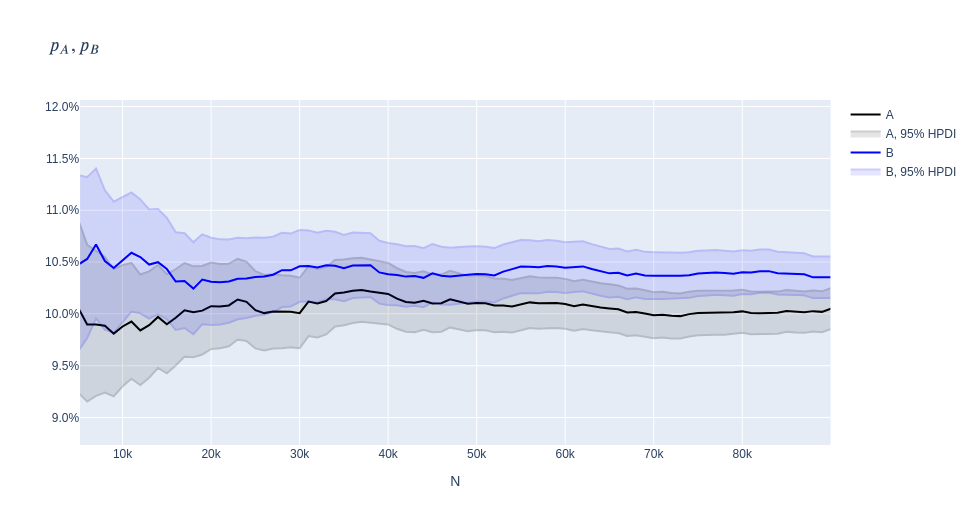

### Bayesian A/B Testing

    

[Bayesian-AB-Testing.ipynb](https://github.com/andrewbrdk/Bayesian-AB-Testing/blob/main/Bayesian-AB-Testing.ipynb). A/B testing is reviewed, and Bayesian modelling is discussed. Conversions, means, revenue per user, orders per visitor are compared in Bayesian approach.

[Байесовская_оценка_АБ-тестов.ipynb](https://github.com/andrewbrdk/Bayesian-AB-Testing/blob/main/%D0%91%D0%B0%D0%B9%D0%B5%D1%81%D0%BE%D0%B2%D1%81%D0%BA%D0%B0%D1%8F_%D0%BE%D1%86%D0%B5%D0%BD%D0%BA%D0%B0_%D0%90%D0%91-%D1%82%D0%B5%D1%81%D1%82%D0%BE%D0%B2.ipynb). Описана механика А/Б-тестов. Рассмотрены примеры байесовского моделирования. Байесовская оценка применена к сравнению конверсий, средних с помощью центральной предельной теоремы, выручки на пользователя, заказов на посетителя. [Видео](https://www.youtube.com/playlist?list=PLqgtGAeapsOPpV0FqeXEpWosHBW8ZebYl), [Хабр](https://habr.com/ru/articles/885936/).
